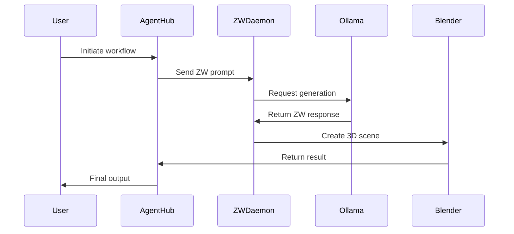

> 🚦 **Phase 9.2.1 — Intent Routing Operational**
> This version establishes the `.zwx` intent-driven architecture with `engain_orbit.py` as the central router,
> including schema validation, execution logging, and foundational multi-engine support.
---
# ZW MCP Ecosystem: AI-Powered Creative Orchestration


*A unified framework for AI-assisted content creation, 3D modeling, and narrative generation*

## Overview

ZW MCP is an advanced ecosystem that bridges AI-powered language models with creative tools through the ZW protocol - a structured format for describing scenes, animations, and narratives. This system enables:

- 🧠 **AI-assisted creation** using Ollama language models
- 🎨 **Procedural 3D content generation** in Blender
- 🤖 **Multi-agent collaboration** for complex tasks
- 🔄 **Roundtrip workflows** between text and 3D environments
- ⚡ **Real-time networked communication** between components

A key component in this ecosystem is **EngAIn-Orbit (`tools/engain_orbit.py`)**, which processes `.zwx` files.
The `.zwx` format separates `ZW-INTENT` (the semantic directive, e.g., target system and function)
from `ZW-PAYLOAD` (the actual ZW data for the creative task). This allows for clear,
AI-dispatchable instructions and modular routing to different backend engines.

```python
# Example ZW Protocol Snippet
ZW-NARRATIVE:
  TITLE: The Awakening
  CHARACTERS:
    - NAME: Tran
      ROLE: Protagonist
  SCENE:
    - OBJECT: Ancient_Relic
      TYPE: Artifact
      MATERIAL: Obsidian
      ANIMATION: Pulsate
```

## Key Features

### Core Components
| Component | Purpose | Key Technologies |
|-----------|---------|------------------|
| **ZW MCP Daemon** | Networked API endpoint | Python, TCP Socket |
| **Ollama Handler** | AI communication layer | REST API, JSON |
| **ZW Parser** | Protocol validation/translation | Python, Regex |
| **Autonomous Agents** | AI-powered task execution | State machines, Memory |
| **Blender Adapter** | 3D content generation | bpy, Geometry Nodes |
| **EngAIn-Orbit Router** | Processes `.zwx` files, routes ZW-PAYLOAD based on ZW-INTENT | Python, `.zwx` |
| **ZW-INTENT Validator** | Validates `ZW-INTENT` blocks in `.zwx` files for structural integrity | Python (in `tools/intent_utils.py`) |

### Advanced Capabilities
- **Multi-Agent Orchestration**
  ```mermaid
  graph LR
    A[Master Seed] --> B[Agent 1]
    B --> C[Agent 2]
    C --> D[Agent 3]
    D --> E[Final Output]
  ```
- **Procedural 3D Generation**
  - Object hierarchies with parenting
  - Material/shader configuration
  - Geometry node operations
  - Keyframe animation system

- **Networked Services**
  - TCP daemon (port 7421)
  - Client/server architecture
  - Session logging/monitoring

## Getting Started

### Prerequisites
- Python 3.9+
- [Ollama](https://ollama.ai/) (local instance)
- Blender 3.0+
- Required packages: `pip install requests numpy`

### Installation
```bash
git clone https://github.com/SmokesBowls/zw_mcp.git
cd zw_mcp
conda create -n zw_env python=3.10
conda activate zw_env
pip install -r requirements.txt
```

### Basic Usage
1. Start the TCP daemon:
```bash
python zw_mcp/zw_mcp_daemon.py
```

2. Send a ZW prompt:
```bash
python zw_mcp/client_example.py prompts/example.zw
```

3. Generate 3D content in Blender:
```bash
blender --background --python zw_mcp/blender_adapter.py
```
(See `tools/engain_orbit.py` for the new primary way to execute ZW content via `.zwx` files)


## System Architecture

### Core Components
```
zw_mcp/
├── core/                 # Central services
│   ├── daemon.py         # TCP server
│   ├── ollama_handler.py # AI communication
│   └── zw_parser.py      # Protocol handling
├── agents/               # Autonomous agents
│   ├── orchestrator.py   # Multi-agent control
│   └── profiles/         # Agent configurations
├── adapters/             # Software integrations
│   └── blender/          # Blender 3D adapter
├── resources/            # Templates and assets
│   ├── prompts/          # ZW input files
│   └── schemas/          # Protocol definitions
└── tools/                # Utilities
    ├── engain_orbit.py   # ZWX intent router
    ├── orbit_watchdog.py # Automated ZWX file processor
    ├── intent_utils.py   # ZW-INTENT validator
    ├── exporter.py       # Blender→ZW conversion
    └── watcher.py        # Directory monitoring
```

### Workflow Diagram


## Advanced Features

### Multi-Agent Collaboration
Configure agent teams in `agents/profiles.json`:
```json
[
  {
    "name": "Narrator",
    "config": "agents/narrator.json",
    "memory": "narrator_memory.db"
  },
  {
    "name": "Designer",
    "config": "agents/designer.json",
    "memory": "designer_memory.db"
  }
]
```

### Blender Integration Examples
**Create a material:**
```zw
ZW-MATERIAL:
  NAME: Emerald
  COLOR: "#50C878"
  ROUGHNESS: 0.2
  METALLIC: 0.8
```

**Animate an object:**
```zw
ZW-ANIMATION:
  TARGET: "Orb"
  PROPERTY: rotation
  KEYFRAMES:
    - FRAME: 0
      VALUE: (0, 0, 0)
    - FRAME: 100
      VALUE: (0, 0, 360)
```

## ✅ Current Project Status & Milestone

**Milestone: Phase 9.2.2 – Automated ZWX Routing + Testing Framework**

This milestone completes the foundational tools for ZWX intent routing and validation.

**Highlights:**
- `.zwx` format with `ZW-INTENT` and `ZW-PAYLOAD` blocks is now fully supported.

- `tools/engain_orbit.py` handles parsing and dispatch of intent directives.
- `tools/orbit_watchdog.py` automates detection + execution of `.zwx` files dropped into a directory.
- `tools/test_orbit_routing.py` provides automated integration testing with expected outcomes based on file naming.
- Test outcomes are logged to `zw_mcp/logs/orbit_test_results.log`.

**Status Tag:** ✅ Stable / Actively Maintained
**Focus:** Integration testing, routing logic, automation reliability


- `engain_orbit.py` handles intent parsing and dispatch.
- `orbit_watchdog.py` automates detection + execution of `.zwx` files.
- `test_orbit_routing.py` runs automated integration tests across valid/invalid ZWX cases.
- All test output is logged in `zw_mcp/logs/orbit_test_results.log`.

**Status Tag:** ✅ Stable / Actively Maintained
**Focus:** Integration testing, routing logic, reliability under automation


## Tools and Utilities

### `tools/engain_orbit.py`: ZWX Execution Router
The `engain_orbit.py` script (located in the `tools/` directory) is the primary entry point for executing `.zwx` files.
Key aspects of this system include:
- **`.zwx` File Format**: Combines a `ZW-INTENT` block (metadata for routing and execution) with a `ZW-PAYLOAD` block (the ZW commands).
  ```
  ZW-INTENT:
    TARGET_SYSTEM: blender
    TARGET_FUNCTION: create_scene
    DESCRIPTION: A simple cube
  ---
  ZW-PAYLOAD:
    OBJECT: MyCube
      TYPE: Cube
      SIZE: 2
  ```
- **Schema Validation**: The `ZW-INTENT` block is automatically validated by `tools/intent_utils.py` to ensure required fields like `TARGET_SYSTEM` are present, aiding in early error detection and debugging of `.zwx` files.
- **Execution Logging**: All routing attempts, successes, and failures (including validation errors) by `engain_orbit.py` are logged with timestamps to `zw_mcp/logs/orbit_exec.log`. This provides a detailed audit trail for diagnostics. Example:
  ```log
  [2023-10-27 10:00:00] ✔ Routed: examples/my_scene.zwx → blender
  [2023-10-27 10:00:05] ❌ Validation FAILED: examples/bad_scene.zwx - Missing TARGET_SYSTEM in ZW-INTENT block.
  ```

### `tools/orbit_watchdog.py`: Automated ZWX File Processor

The `orbit_watchdog.py` script provides an automated way to process `.zwx` files.
It monitors a specified directory for new `.zwx` files, and upon detection,
it uses `engain_orbit.py` to validate and route them.

**Key Features:**
- **Automated Processing**: Continuously watches a folder for new files.
- **Uses EngAIn-Orbit**: Leverages `engain_orbit.py` for the core processing logic (validation, routing).
- **File Management**: Moves processed files to designated subfolders (`executed/` for successes, `failed/` for failures).
- **Logging**: Records its activities, including files processed and outcomes, to `zw_mcp/logs/orbit_watchdog.log`.
- **Single Run Mode**: Supports a `--once` flag to scan the folder once and then exit.

**Directory Structure:**
The watchdog expects the following directory structure (relative to the project root):
- `zw_drop_folder/validated_patterns/`: The directory monitored for new `.zwx` files.
- `zw_drop_folder/executed/`: Successfully processed files are moved here.
- `zw_drop_folder/failed/`: Files that failed processing are moved here.

Ensure these directories are created before running the watchdog, or the script will attempt to create them.

**Usage:**
To run the watchdog continuously:
```bash
python3 tools/orbit_watchdog.py
```
To scan the folder once and exit:
```bash
python3 tools/orbit_watchdog.py --once
```

## Development Roadmap

### Current Features
- [x] ZW protocol parser/validator
- [x] TCP networking layer
- [x] Ollama API integration
- [x] Blender scene generation
- [x] Multi-agent orchestration
- [x] EngAIn-Orbit `.zwx` router (`tools/engain_orbit.py`)
- [x] ZW-INTENT schema validation (`tools/intent_utils.py`)
- [x] Execution logging for EngAIn-Orbit (`zw_mcp/logs/orbit_exec.log`)
- [x] Automated ZWX file processing (`tools/orbit_watchdog.py`)

### Planned Features
- [ ] Godot engine integration (Stubbed in `engain_orbit.py` for basic routing)
- [ ] Web-based control interface
- [ ] Versioned memory system
- [ ] Physics simulation support
- [ ] Audio-reactive animations


## Testing and Validation

This project includes a test suite to verify the functionality of the ZWX intent-routing pipeline.

### Automated Test Suite

The primary test runner is `tools/test_orbit_routing.py`. It automatically discovers and executes `.zwx` test files located in the `zwx-test-suite/` directory.

**Running the Suite:**
To execute all tests:
```bash
python3 tools/test_orbit_routing.py
```
The script will print a summary of test results to the console, indicating total tests, expected passes/fails, and actual passes/fails.

**Interpreting Results:**
- Test files in `zwx-test-suite/` prefixed with `invalid_` (e.g., `invalid_missing_target.zwx`) are expected to cause an error during processing by `engain_orbit.py` (i.e., `engain_orbit.py` should exit with a non-zero status code). The test runner counts this as a **test pass** if the error occurs as expected.
- All other test files are expected to be processed successfully by `engain_orbit.py` (i.e., exit with a zero status code).

**Test Logs:**
Detailed logs for each test run, including the command output and specific errors for failed tests, are written to:
`zw_mcp/logs/orbit_test_results.log`

### Manual Testing with Watchdog

You can also perform manual or simulation testing using the `orbit_watchdog.py` tool:
1. Ensure `tools/orbit_watchdog.py` is running (either continuously or with the `--once` flag).
   ```bash
   python3 tools/orbit_watchdog.py
   ```
2. Copy or create `.zwx` files in the `zw_drop_folder/validated_patterns/` directory.
3. The watchdog will automatically pick up these files, process them via `engain_orbit.py`, and move them to `zw_drop_folder/executed/` or `zw_drop_folder/failed/`.
4. Review `zw_mcp/logs/orbit_watchdog.log` for processing details and `zw_mcp/logs/orbit_exec.log` for `engain_orbit.py` execution details.

This approach helps simulate production ingestion and validate the end-to-end automated workflow.

## Contributing

We welcome contributions! Please follow these steps:

1. Fork the repository
2. Create your feature branch (`git checkout -b feature/amazing-feature`)
3. Commit your changes (`git commit -m 'Add amazing feature'`)
4. Push to the branch (`git push origin feature/amazing-feature`)
5. Open a pull request

## License

Distributed under the MIT License. See `LICENSE` for more information.

## Contact

SmokesBowls - [@YourTwitter](https://twitter.com/yourhandle) - email@example.com

Project Link: [https://github.com/SmokesBowls/zw_mcp](https://github.com/SmokesBowls/zw_mcp)

---

```python
# Example Agent Configuration
AGENT_CONFIG = {
    "style": "You are an architectural designer specializing in futuristic structures",
    "memory": {
        "enabled": True,
        "depth": 5,
        "path": "memory/designer.json"
    },
    "parameters": {
        "creativity": 0.7,
        "detail_level": "high",
        "preferred_materials": ["carbon_fiber", "neoprene"]
    }
}
```

**Ready to create?** Start with our [Quickstart Guide](docs/QUICKSTART.md) or explore the [Example Gallery](examples/).

